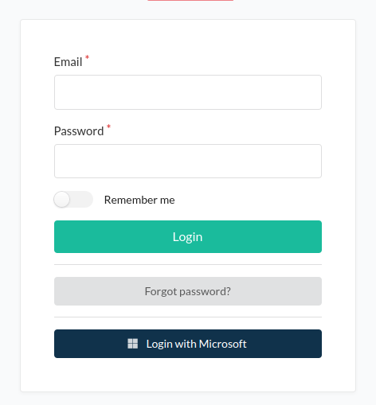

<h1 align="center">GL events SyliusAdminSamlPlugin</h1>


## Features

This plugin allow your admin users to sign in with SAML providers (Google, Azure, Okta, etc.)

<p align="center">
    
</p>

## Installation

1. Add the bundle to your `composer.json` file:
 ```bash
    composer require gl-events/sylius-admin-saml-plugin
  ```
2. Write your Identity Provider informations in your `.env` file:
 ```bash
    SAML_IDP_ENTITY_ID=
    SAML_IDP_SSO_URL=
    SAML_IDP_SLO_URL=
    SAML_IDP_CERTIFICATE=
    SAML_IDENTIFIER_KEY=
```
3. Add your SP private key in your `.env` file (you can generate one at your project root with `openssl genpkey -algorithm RSA -out private.key`):
 ```bash
    SAML_SP_PRIVATE_KEY=
```
4. Enable or not the traditionnal sylius admin form login in your `.env` file:
 ```bash
    SYLIUS_ADMIN_LOGIN=
```

5. Add the plugin class to your `config/bundles.php` file:
    
```php
    return [
        ...
        GlEvents\SyliusAdminSamlPlugin\GlEventsSyliusAdminSamlPlugin::class => ['all' => true],
    ];
```
6. Add default config

```yaml
# config/packages/gl_events_saml_admin_plugin.yaml

imports:
    - { resource: "@GlEventsSyliusAdminSamlPlugin/Resources/config/config.yaml" }


```

7. Add in your `config/security.yaml` file:

```yaml
        providers:
            saml_provider:
              id: gl_events.saml_plugin.provider.saml_user
        firewalls:
              saml:
                    pattern: ^/saml
                    stateless: true
                    custom_authenticator: gl_events.saml_plugin.security.saml_authenticator
              main:
                    lazy: true
                    provider: saml_provider
        access_control:
              - { path: "%sylius.security.admin_regex%/saml", role: ROLE_SUPER_ADMIN }
              - { path: "%sylius.security.admin_regex%/login/saml", role: PUBLIC_ACCESS }
              - { path: "%sylius.security.admin_regex%/login/saml/logout", role: PUBLIC_ACCESS }
              - { path: "%sylius.security.admin_regex%/login/saml/acs", role: PUBLIC_ACCESS }
              - { path: "%sylius.security.admin_regex%/login/saml/sls", role: PUBLIC_ACCESS }
              - { path: "%sylius.security.admin_regex%/login/saml/metadata", role: PUBLIC_ACCESS }

```
8. Add in your `config/routes.yaml` file:

```yaml
   glevents_sylius_admin_saml_plugin:
        resource: "@GlEventsSyliusAdminSamlPlugin/Resources/config/routing.yml"
```
You are now ready to go  ! 🚀

## Credits

Developed by [GL Events](https://gl-events.com/).
